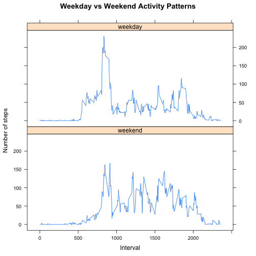

Reproducible Research: Peer Assessment 1
========================================


## Loading and Pre-processing the Data
After downloading the **Activity monitoring data** from the course website, we will have a zip called `repdata-data-activity.zip`. After the download is complete, move and extract the .zip file to your working directory for R. Once you have done that we can start loading and pre-processing the data.  

In order to load the data `activity.csv`, I am going to read in the data using read.csv(). Once I have read the data into a variable called `activity.data`, I am going to convert the `date` factor of `activity.data` into a Date-time class.

```r
activity.data <- read.csv("activity.csv")
activity.data$date <- strptime(activity.data$date, "%Y-%m-%d")
head(activity.data)
```

```
##   steps       date interval
## 1    NA 2012-10-01        0
## 2    NA 2012-10-01        5
## 3    NA 2012-10-01       10
## 4    NA 2012-10-01       15
## 5    NA 2012-10-01       20
## 6    NA 2012-10-01       25
```


## What is mean total number of steps taken per day?
I am going to summarize `activity.data` by `date` and keep track of the total number of steps per day.

```r
library(plyr)
activity.data.summary <- ddply(activity.data, ~date, summarize, total = sum(steps, 
    na.rm = TRUE))
head(activity.data.summary)
```

```
##         date total
## 1 2012-10-01     0
## 2 2012-10-02   126
## 3 2012-10-03 11352
## 4 2012-10-04 12116
## 5 2012-10-05 13294
## 6 2012-10-06 15420
```

Below is the code and the histogram to display the total number of steps taken per day.

```r
# with(activity.data.summary, hist(total,breaks=10,xlab='Total Number of
# Steps',main='Histogram of Total Number of Steps'))

with(activity.data.summary, plot(as.Date(date), total, xlab = "Date", type = "h", 
    ylab = "Steps", main = "Histogram of Total Number of Steps", lwd = 5, lty = 1, 
    lend = "square"))
```

 

Now that we have a rough idea  of the number of steps taken per day visually, I am going to calculate the mean and median total number of steps taken per day.  

**Mean total number of steps**  
Here is the mean total number of steps taken per day:

```r
mean.total.steps <- mean(activity.data.summary$total)
```

The mean total number of steps is **9354.2295**.  

**Median total number of steps**  
Here is the median total number of steps taken per day:

```r
median.total.steps <- median(activity.data.summary$total)
```

The median total number of steps is **10395**.  

## What is the average daily activity pattern?
I am going to summarize `activity.data` by `interval` and keep track of the average number of steps per interval.

```r
activity.data.summary2 <- ddply(activity.data, ~interval, summarize, avg = mean(steps, 
    na.rm = TRUE))
head(activity.data.summary2)
```

```
##   interval     avg
## 1        0 1.71698
## 2        5 0.33962
## 3       10 0.13208
## 4       15 0.15094
## 5       20 0.07547
## 6       25 2.09434
```

Next, we will plot 5-minute interval versus the average number of steps taken, averaged across all days.

```r
with(activity.data.summary2, plot(interval, avg, xlab = "Interval", ylab = "Average Number of Steps", 
    type = "l", main = "Average Number of Steps across all Days by Interval"))
```

 

The 5-minute interval, on average across all the days in the data set, that contains the maximum number of steps can be found with the following code:

```r
max.avgSteps.interval <- activity.data.summary2[which.max(activity.data.summary2$avg), 
    1]
```

Therefore the 5-minute interval with the maximum number of steps is **835**.

## Inputing missing values
Going back to the original data set created in the section **Loading and Preprocessing the Data**, we want to create a full data set by replacing the non-available data, `NAs`, with values instead of ignoring the values in calculations.  

In order to do that we first need to know how many values are `NA`. We can find this out with the following code:

```r
number.NAs <- sum(is.na(activity.data$steps))
```

The total number of missing values in the data set is **2304**.  

In order to fill the missing values in the data set, I am going to replace the NAs with their avg steps across all days for their corresponding interval (i.e. Use avg values found in previous section to replace `NAs` for that interval).

```r
new.activity.data <- activity.data
for (x in activity.data.summary2$interval) {
    new.activity.data$steps[is.na(new.activity.data$steps) & new.activity.data$interval == 
        x] <- activity.data.summary2$avg[activity.data.summary2$interval == 
        x]
}
head(new.activity.data)
```

```
##     steps       date interval
## 1 1.71698 2012-10-01        0
## 2 0.33962 2012-10-01        5
## 3 0.13208 2012-10-01       10
## 4 0.15094 2012-10-01       15
## 5 0.07547 2012-10-01       20
## 6 2.09434 2012-10-01       25
```


I am going to summarize `new.activity.data` by `date` and keep track of the total number of steps per day.

```r
new.activity.data.summary <- ddply(new.activity.data, ~date, summarize, total = sum(steps, 
    na.rm = TRUE))
head(new.activity.data.summary)
```

```
##         date total
## 1 2012-10-01 10766
## 2 2012-10-02   126
## 3 2012-10-03 11352
## 4 2012-10-04 12116
## 5 2012-10-05 13294
## 6 2012-10-06 15420
```

Below is the code and the histogram to display the total number of steps taken per day.

```r
with(new.activity.data.summary, hist(total, breaks = 10, xlab = "Total Number of Steps", 
    main = "Histogram of Total Number of Steps"))
```

 

Now that we have a rough idea  of the number of steps taken per day visually, I am going to calculate the mean and median total number of steps taken per day.  

**Mean total number of steps**  
Here is the mean total number of steps taken per day:

```r
mean.total.steps2 <- mean(new.activity.data.summary$total)
```

The mean total number of steps is **10766**.  

**Median total number of steps**  
Here is the median total number of steps taken per day:

```r
median.total.steps2 <- median(new.activity.data.summary$total)
```

The median total number of steps is **10766**.  

To calculate the difference between the mean and median total number of steps from just ignoring NAs to replacing them is below:

```r
difference.between.means <- abs((mean.total.steps - mean.total.steps2))
difference.between.median <- abs((median.total.steps - median.total.steps2))
```

The difference between means is **1411.9592** and the difference between medians is **371.1887**.  
  
Below is the calculations for finding the percent difference between the means and medians.

```r
percent.difference.mean <- ((mean.total.steps2/mean.total.steps) - 1) * 100
percent.difference.median <- ((median.total.steps2/median.total.steps) - 1) * 
    100
```

By replacing the NAs with their avg steps across all days for the corresponding interval we see that the mean total number of steps taken per day is increased by about **15%** overall. The median is only increased by about **4%** overall.  

## Are there differences in activity patterns between weekdays and weekends?
In order to see the differences in activity patterns between weekdays and weekends, we first need to add a column so that we can clearly see which sets of data belong to weekdays and weekends.

```r
new.activity.data$type.of.day <- factor(weekdays(new.activity.data$date), ordered <- c("Sunday", 
    "Monday", "Tuesday", "Wednesday", "Thursday", "Friday", "Saturday"))
levels(new.activity.data$type.of.day) <- c("weekend", "weekday", "weekday", 
    "weekday", "weekday", "weekday", "weekend")
head(new.activity.data)
```

```
##     steps       date interval type.of.day
## 1 1.71698 2012-10-01        0     weekday
## 2 0.33962 2012-10-01        5     weekday
## 3 0.13208 2012-10-01       10     weekday
## 4 0.15094 2012-10-01       15     weekday
## 5 0.07547 2012-10-01       20     weekday
## 6 2.09434 2012-10-01       25     weekday
```

Now let's plot the activity patterns for weekdays and weekends. First we create a new data frame that calculates the average of steps by the type of day of the week and corresponding interval. Then we plot the avg steps taken over the type of day of the week according to the interval. See the below calculations and plot.

```r
new.activity.data.summary3 <- ddply(new.activity.data, .(type.of.day, interval), 
    summarize, avg = mean(steps, na.rm = TRUE))
head(new.activity.data.summary3)
```

```
##   type.of.day interval      avg
## 1     weekend        0 0.214623
## 2     weekend        5 0.042453
## 3     weekend       10 0.016509
## 4     weekend       15 0.018868
## 5     weekend       20 0.009434
## 6     weekend       25 3.511792
```

```r
library(lattice)
xyplot(new.activity.data.summary3$avg ~ new.activity.data.summary3$interval | 
    new.activity.data.summary3$type.of.day, layout = c(1, 2), type = "l", xlab = "Interval", 
    ylab = "Number of steps", main = "Weekday vs Weekend Activity Patterns")
```

 

